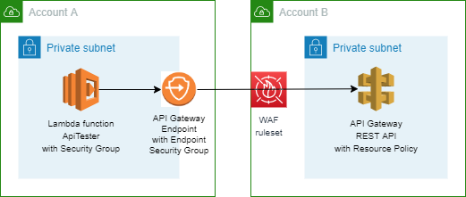
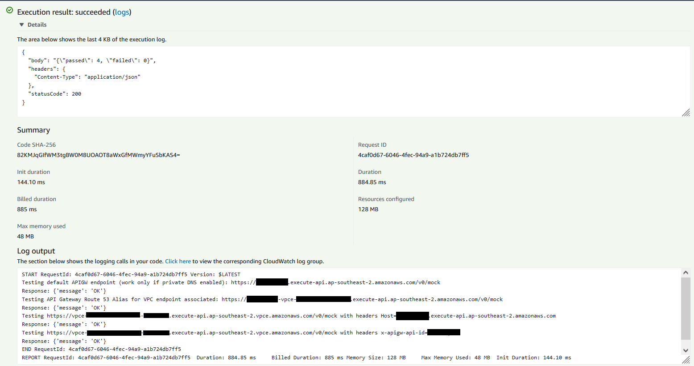

# access-private-apigw-in-another-account

This repo provides a working example for calling a private API Gateway REST API from another AWS account, including CloudFormation templates, API test code and GitHub Actions workflows.

## Concept

To use an interface VPC endpoint to access an API Gateway private REST API that's in another AWS account, do the following:

1. Create an interface endpoint in a VPC in one account (account A).
2. Create an API Gateway private REST API in a second account (account B).
3. Configure a resource policy for the private REST API that allows the interface endpoint to invoke the API.
4. Test the setup by calling the private REST API from account A. There are 4 ways to call the API and are covered in the Lambda function ApiTesterFunction ([ApiTester.py](./function/ApiTester.py)).

For details see [How can I access an API Gateway private REST API in another AWS account using an interface VPC endpoint?](https://aws.amazon.com/premiumsupport/knowledge-center/api-gateway-private-cross-account-vpce/)

## Deployment Example

1. The workflow [deploy-apigw-vpce.yaml](./.github/workflows/deploy-apigw-vpce.yaml) deploys the interface VPC endpoint for API Gateway execute-api associated to VPC subnet(s) in Account-A.
2. The workflow [deploy-apigw.yaml](./.github/workflows/deploy-apigw.yaml) deploys a simple API Gateway private REST API to Account-B. The stack deploys deploy a resource policy for the private REST API that allows the interface endpoint to invoke the API.
3. The workflow [deploy-lambda-api-tester.yaml](./.github/workflows/deploy-lambda-api-tester.yaml) deploys a Lambda function to VPC subnet(s) in Account-A, for testing the

## Testing the API endpoints with the Lambda function ApiTesterFunction

The Lambda function ApiTesterFunction ([ApiTester.py](./function/ApiTester.py)) tests the 4 endpoints/approaches accessing the API in another AWS account:

1. Default APIGW endpoint; work only if private DNS enabled for your interface endpoint

       https://dummyapiid.execute-api.ap-southeast-2.amazonaws.com/v0/mock

1. API Gateway Route 53 Alias for VPC endpoint associated

       https://dummyapiid-vpce-12345678901234567.execute-api.ap-southeast-2.amazonaws.com/v0/mock

1. Public DNS name with a Host header

       https://vpce-12345678901234567-abcd1234.execute-api.ap-southeast-2.vpce.amazonaws.com/v0/mock with headers Host=dummyapiid.execute-api.ap-southeast-2.amazonaws.com

1. Public DNS name with the x-apigw-api-id header

       https://vpce-12345678901234567-abcd1234.execute-api.ap-southeast-2.vpce.amazonaws.com/v0/mock with headers x-apigw-api-id=dummyapiid

Example of the Lambda function (ApiTesterFunction) execution log

